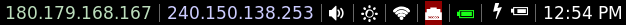

# i3-supersaiyaan-blocks
Custom, beautiful i3blocks configuration.

# Dependencies:
1. `requests` (available in PyPi)
2. Installation of font inside `fonts/` directory
3. `acpi` for battery
4. `netifaces` (available in PyPi)

# Debugging
If some of the scripts do not work, execute it directly to see whether it's working.

# License
Licensed under the MIT license
